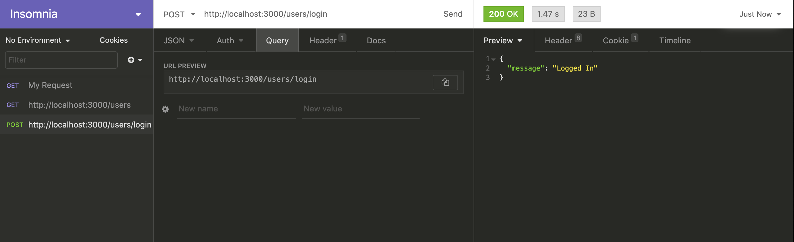

# Authentication-Project
Used Node.js, Express and Knex to build an API that provides protected routes, sessions, Register and Login functionality using SQLite to store User information. The password is not stored as plain text and cookies are used to authenticate the users.

| Method | Endpoint      | Description                                                                                                                                                                                                                                                                                         |
| ------ | ------------- | --------------------------------------------------------------------------------------------------------------------------------------------------------------------------------------------------------------------------------------------------------------------------------------------------- |
| POST   | /api/register | Creates a `user` using the information sent inside the `body` of the request. **Hash the password** before saving the user to the database.                                                                                                                                                         |
| POST   | /api/login    | Use the credentials sent inside the `body` to authenticate the user. On successful login, create a new session for the user and send back a 'Logged in' message and a cookie that contains the user id. If login fails, respond with the correct status code and the message: 'You shall not pass!' |
| GET    | /api/users    | If the user is logged in, respond with an array of all the users contained in the database. If the user is not logged in repond with the correct status code and the message: 'You shall not pass!'.                                                                                                |

Added support for **sessions** and **cookies** to keep a record of logged in users across requests.

